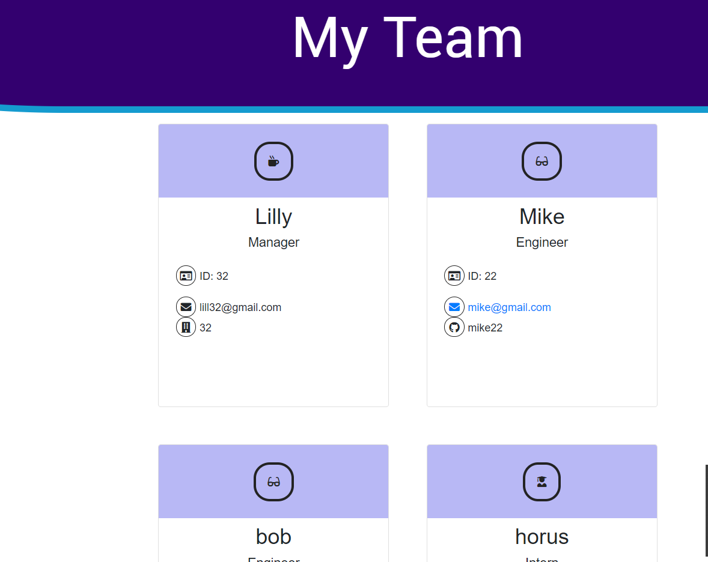

:part_alternation_mark:

# Team_Builder
A Team Builder Application based on Node.js using Class Inheritance

>Link to page https://mt2314.github.io/Team_Builder/

## Team_Builder application description and goal
---

 

>Build a Team Builder application 

>Prompt the user in CLI using Node.js to add role specific employees to a team

>Prompt for role and employee specific details. (Engineers--Github , Managers--Office Number...)

>Exports the dynamically created HTML(team.html) to new folder named output. 

 
 

## Credits
---
:school: 
**University of Toronto Continuing Educationg
Full Stack Flex Program** - *Initial HTML and CSS*
:school:

:heart: 
*Students and Instructors At the UFT-FSF-2020-2021*
:heart:

 

## License
---

All rights reserved.

Licensed under the MIT license.
 

 

:lock::lock::lock::lock:

_____
____
___